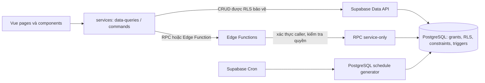

# Kiến trúc, công nghệ và bản đồ mã nguồn

## Kiến trúc tổng thể

Ứng dụng là Vue SPA tĩnh trên GitHub Pages. Supabase cung cấp Auth, PostgreSQL/Data API, RLS, RPC và Edge Functions. Các tác vụ lặp chạy qua Supabase Cron/PostgreSQL. Frontend chỉ chứa cấu hình công khai.

## Công nghệ

| Phần | Công nghệ hiện khai báo | Vai trò |
|---|---|---|
| Frontend | Vue 3.5, TypeScript 5.9, Vue Router 4, Pinia 3, Bootstrap 5, Vite 7 | SPA theo vai trò; router dùng hash history để chạy trên Pages. |
| Supabase client | `@supabase/supabase-js` 2.57 | Auth và Data API; client dùng publishable key. |
| File export | SheetJS `xlsx` 0.20.3 | Tạo một số export học sinh/roster; xử lý cẩn thận vì file có thể chứa dữ liệu cá nhân. |
| Backend | Supabase PostgreSQL, Auth, RLS, PL/pgSQL, RPC | Lưu dữ liệu và thực thi quyền/ràng buộc nghiệp vụ. |
| Serverless | Supabase Edge Functions trên Deno | Xác thực caller, thao tác đặc quyền, tích hợp Gemini ở các route AI và gọi RPC service-only. |
| Lịch nền | PostgreSQL `pg_cron`/Supabase Cron | Sinh buổi lặp và đồng bộ roster trong backend. |
| Test frontend | Vitest 3, Vue Test Utils, jsdom | Unit/component tests đặt cạnh source. |
| CI/deploy | GitHub Actions, GitHub Pages, Supabase CLI | Quality check, deploy frontend và workflow backend thủ công. |

Manifest là nguồn phiên bản dependency chính xác. Môi trường dự án yêu cầu Node.js 22.x và npm 10+; `package-lock.json` khóa cây phụ thuộc.

## Frontend: nơi bắt đầu và trách nhiệm

| Khu vực | Trách nhiệm |
|---|---|
| `frontend/src/main.ts`, `App.vue` | Khởi tạo Vue, Pinia, router, Bootstrap, style và shell gốc. |
| `frontend/src/app/router/` | Route hash và điều hướng theo role/trạng thái; không phải lớp bảo mật dữ liệu. |
| `frontend/src/app/layouts/`, `components/` | Layout, modal, field, calendar, trạng thái, toast và component dùng chung. |
| `frontend/src/stores/` | Auth/session, lỗi ứng dụng và toast; không có store nghiệp vụ tổng quát. |
| `frontend/src/modules/auth/` | Đăng nhập và đổi mật khẩu bắt buộc. |
| `frontend/src/modules/admin/` | Học sinh, hồ sơ, nhân sự, lớp, lịch/buổi (sửa lịch, roster, hủy/xóa buổi tương lai) và duyệt chấm công. |
| `frontend/src/modules/staff/` | Buổi được giao, điểm danh/đánh giá, nội dung bài học, hồ sơ và yêu cầu chấm công. |
| `frontend/src/modules/student/` | Lịch, kết quả học tập, xem lại video và chat AI. |
| `frontend/src/services/data-queries.ts` | Truy vấn/đọc dữ liệu và chuẩn hóa quan hệ Supabase. |
| `frontend/src/services/commands.ts` | Lệnh ghi: CRUD đơn giản có RLS, RPC và Edge Function. |
| `frontend/src/services/edge-functions.ts` | Gọi Edge Function và chuẩn hóa lỗi/trace id. |
| `frontend/src/shared/` | Domain types, role, format, error mapping và helper nghiệp vụ. |
| `frontend/src/devtools/ui-review/` + `frontend/review/` | Review các page thật với mock auth/services và fixture `QA-`; không kết nối Supabase thật. |

### Luồng frontend và server

- CRUD đơn giản có thể dùng Supabase Data API trực tiếp từ adapter hiện hành; grants và RLS phải giới hạn từng hàng/cột.
- Dùng RPC/Edge Function khi cần transaction, kiểm tra trạng thái hoặc thao tác quyền cao. Không gọi server đặc quyền rải rác trong component.
- Edge Function xác thực người gọi, role/trạng thái và input trước khi gọi RPC/service role. Secret chỉ nằm trong môi trường server.
- UI và route guard giúp điều hướng; PostgreSQL/RPC/Edge Function quyết định quyền cuối cùng.

### Route theo vai trò

- Admin: `/admin/students`, `/admin/staff`, `/admin/classes`, `/admin/sessions`, `/admin/timesheets`.
- Giáo viên: `/staff/sessions`, `/staff/timesheets`, `/staff/profile`.
- Học sinh: `/student/schedule`, `/student/attendance`, `/student/review`, `/student/ai`.
- Auth: `/login`, `/auth/change-password`.
- `ROOT_ADMIN` dùng giao diện Admin. Học sinh/giáo viên có cờ đổi mật khẩu phải vào màn hình đổi mật khẩu trước luồng khác.

## Supabase: database và Edge Functions

- `supabase/migrations/` là schema, enum, constraints, functions/RPC, grants, RLS, index và thay đổi theo thứ tự; migration mới nhất trong repo hiện là `0056`.
- `supabase/functions/<name>/index.ts` là HTTP entrypoint; một số route tách `handler.ts` để kiểm thử logic. `_shared/` chứa auth, CORS, password-reset và response/error.
- Các route hiện có bao phủ account status/create/reset, bootstrap/login, cập nhật trạng thái buổi và learning, AI học sinh, tối ưu nhận xét giáo viên, và submit/review chấm công. Danh sách từng file nằm trong inventory.
- `supabase/tests/` chứa kiểm thử SQL cho lập buổi, conflict phòng, giới hạn teacher, learning/RLS, roster và timesheet. Đọc test liên quan cùng migration tạo/sửa object.
- Cron và schedule generator được định nghĩa ở migration/config backend. Tài liệu source nói sinh trong 30 ngày theo `Asia/Ho_Chi_Minh`; xác minh cấu hình/backend trực tiếp trước khi khẳng định lịch Cron production đang hoạt động.

## Cách lần theo một thay đổi

1. Từ route/page xác định hành động và dữ liệu mà UI hiển thị.
2. Lần tới `data-queries.ts` hoặc `commands.ts`, sau đó xác định Data API, RPC hay Edge Function.
3. Đọc migration hiện hành tạo object và các migration tiếp theo đã thay đổi object đó; kiểm tra grants/RLS/helper liên quan.
4. Đọc test frontend hoặc SQL bao phủ hành vi; với thay đổi UI, dùng Chrome và UI review harness theo chỉ dẫn repo.

Danh mục đầy đủ từng file và mục đích: [repository-inventory.md](repository-inventory.md). Quy tắc nghiệp vụ: [product-and-workflows.md](product-and-workflows.md). Quyền/migration: [data-security-and-migrations.md](data-security-and-migrations.md).
